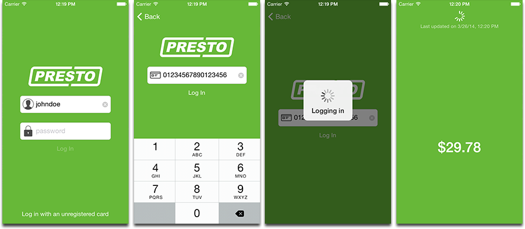

# Presto for iOS

Unofficial [Presto](http://prestocard.ca) iOS app. Pretty unexciting right now. Currently only shows the current balance on a Presto card. Works with both registered and unregistered cards.

Soon, this will allow you to:

* receive push notifications when your card's balance changes
* load your card

## Credits

Presto for iOS is built using the following open-source projects:

* [SVProgressHUD](https://github.com/samvermette/SVProgressHUD) by Sam Vermette
* [FCModel](https://github.com/marcoarment/FCModel) by Marco Arment
* [FMDB](https://github.com/ccgus/fmdb) by Gus Mueller

The backend is also open-source: [presto_api](https://github.com/jpsim/presto_api)

The username and password icons are from [Glyphish](http://glyphish.com) and the [card icon](http://thenounproject.com/term/browser/20806/) is by [Luboš Volkov](http://thenounproject.com/Lubo%C5%A1%20Volkov).

## License

The Presto for iOS source code is released under the [Simplified BSD License](https://github.com/jpsim/presto_ios/blob/master/LICENSE). This license does not cover the image assets. All images are property of Magnetic Bear Studios Inc or their respective artists.

Please don't redistribute this app exactly the way it is in the App Store. There's nothing stopping you, but please be considerate.

## Notice

Please respect Presto's [Terms and Conditions](https://www.prestocard.ca/en-US/Pages/ContentPages/Terms.aspx).
